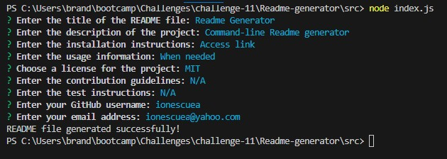

# Professional README Generator

A high-quality README file generator.

## Description

A command-line application that dynamically generates a professional README.md file from a user's input using the [Inquirer package](https://www.npmjs.com/package/inquirer).

## Instalation

The code can be accessed [here](https://github.com/ionescuea/Readme-generator).

## Usage

The application will be invoked by using the following command:

'bash'
'node index.js'
Then, the user should complete the prompts in the terminal whit the necessary info in order to generate the professional Readme file.

See below the image and the video:

## Credits

[BootcampSpot](https://github.com/edx)

[Alexandra Ionescu](https://github.com/ionescuea)

## License

Licensed under the [MIT](LICENSE) license.
